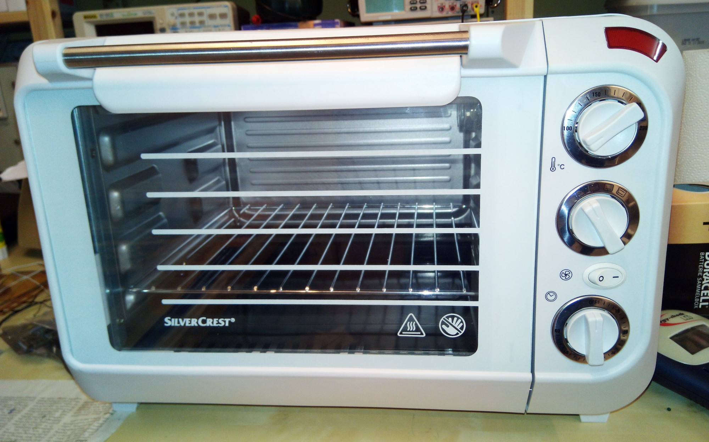

# Furnace
Modifying a hot air oven for reflow soldering and filament drying

## Current state

Some time ago I bought a cheap hot air oven for reflow soldering and haven't
done anything with it so far. Now I am also an owner of an Anet A8 3d
printer and ran into trouble with older filaments so I wanted to use the
oven for that.

The problem is the temperature control since in initial state the lowest
possible temperature was about 100° C to set and it also is only time-based
with a bi-metal switch. I modified the limit stop for temperature so that it
stays mostly in the range below 50 degree but sometimes it will also go
above which is too high for PLA. Another problem is the limited timing of
maximal one hour which is too short for filmanent drying (and much too long
for soldering).

## Plan

Implement a microcontroller based temperature control
- SSR control for top heat and lower heat independently
- Temperature measurent with PT100 (can measure up to 400° C)
- Temperature and humidity measurement, removeable for reflow solder
- A display for current and target temperature, time etc.

## Open points

- how warm will it be in the intended installation placw at 250°?
- temperature control algorithm (simple two point?)
